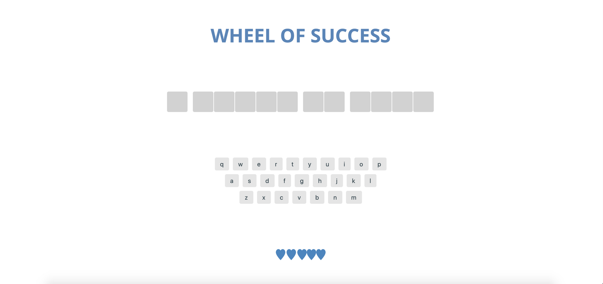
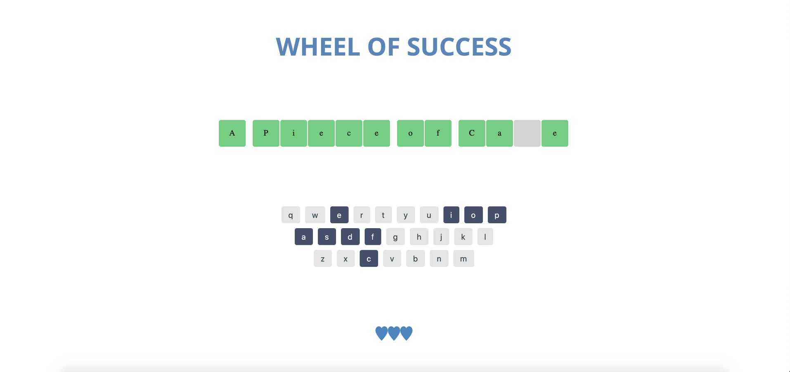
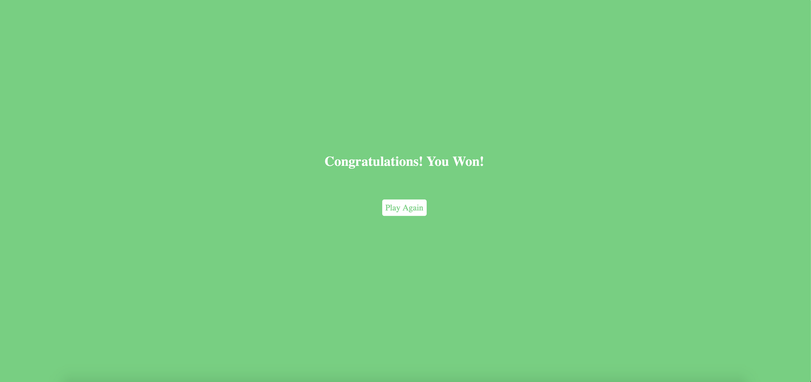
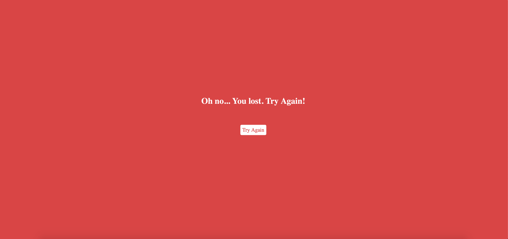

# game_show_app
# Wheel of Success Game Show Application Project

## Project Description

This project implements a browser based version of a game called 'Wheel of Success'.

The game involves the User attempting to guess the random phrase that is shown on the screen. 

The User can select their choice of letters by clicking on the virtual Keyboard displayed on the Screen. If the random phrase contains the chosen letter, the appropriate letter in the phrase is shown leaving the remaining guesses still hidden.

The User is given five "lives" to guess incorrectly. Each time an incorrect guess is made, the number of lives shown at the bottom of the screen is decremented.

The Game concludes when either the User guesses the phrase correctly or runs out of lives.

At this point, the appropriate Won or Lost screen is shown. Both allows the User to play another round of the game.

## Demo
https://sidharthamishra.github.io/game_show_app/

----

## Screenshots of the App
<center>


*Screenshot of the Welcome Page*



*Screenshot of the Main Game Page*


*Screenshot of the Game In-Progress*


*Screenshot of the Game Won Screen*


*Screenshot of the Game Lost Screen*
</center>
-----

## Project Structure

```
    game_show_app
    |
    |
    |- css
    |   |
    |   |- styles.css
    |
    |
    |- images
    |   |- liveHeart.png
    |   |- lostHeart.png
    |   |- screenshot_01.png
    |   |- screenshot_02.png
    |   |- screenshot_03.png
    |   |- screenshot_04.png
    |   |- screenshot_05.png
    |
    |
    |- js
    |   |- app.js
    |
    |
    |- index.html
    |
    |- README.md

```
----
## Technologies Used

* HTML
* CSS
* JS
* Markdown (Documentation)
* Chrome Dev Tools
* VS Code
* Tested on: Chrome, Safari, Opera, and Firefox Browsers
* PicResize